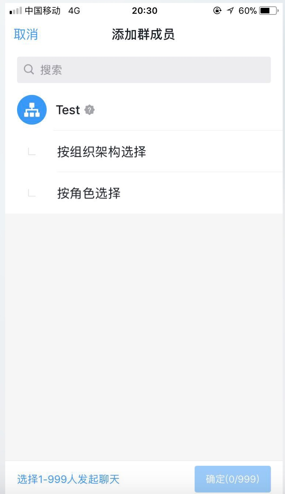

# 开发体感
## 第三方企业应用
### 开发准备
#### 注册账号
##### 1. 分配子管理员
> 设置子管理员之前需要先将员工添加至**通讯录**,否则无法添加子管理员


##### 2.添加成员
> 从 **钉钉手机客户端** -> **企业群** 中无法直接添加成员



> 需要从 **钉钉管理后台** -> **通讯录** 中添加成员


#### 前端IDE使用
##### 1.项目创建中图片待更新
> 更新前


> 更新后


### QuickStart
#### 在IDE上设置体验组织
```
在开发者后台添加体验组织并开通后，IDE中不会立即同步
需要等十分钟并重启IDE才会显示体验组织
```


### 真机预览
> 从钉钉手机客户端中无法进行预览


> 点开后跳转到 


> _以上为**测试版**ISV应用_
_**正式版**ISV应用设置回调URL时显示URL地址在黑名单中不允许使用_


